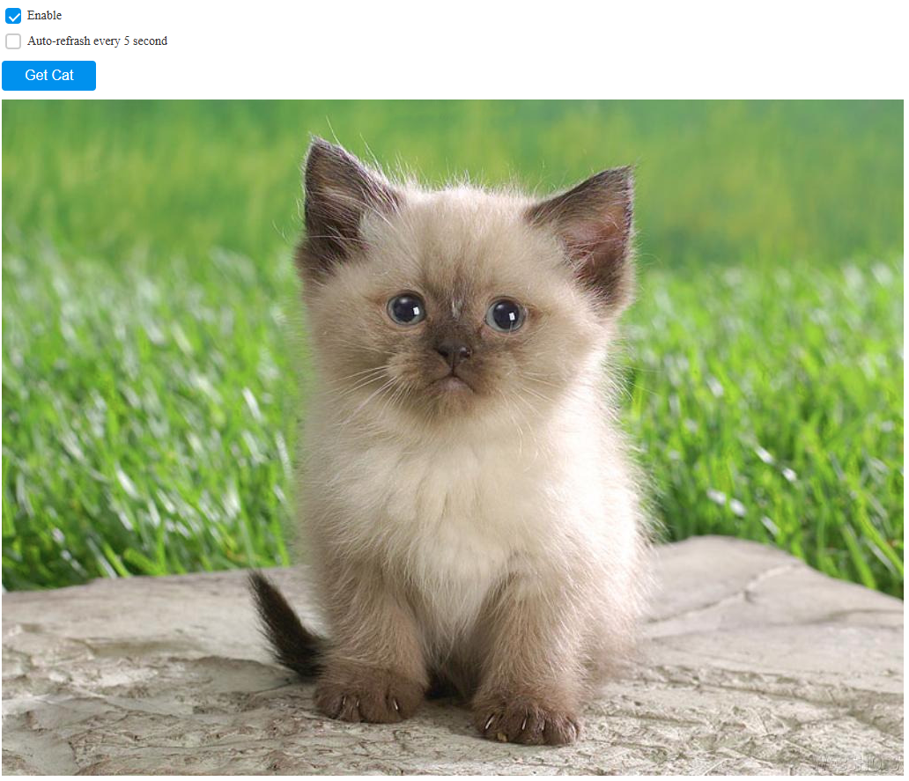

# Приложение Get Cat
Тренировочное мини приложение. Запрос картинок при нажатии на кнопку. При выключенном чекбоксе Enable кнопка неактивна. При включенном втором чекбоксе происходит автообновление изображения каждые 5 секунд

## Ссылка на деплой GH-pages
https://alkorotkovv.github.io/the_cat/

## Установка и запуск

npm install находясь в корневом каталоге - установка необходимых пакетов
npm run start - запуск

## Стек
- React (функциональные компоненты)
- TypeScript
- Axios
- Sass
- Styled-components
- CSS modules
- Кастомный хук

